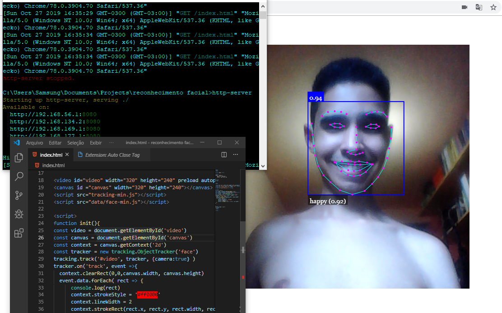
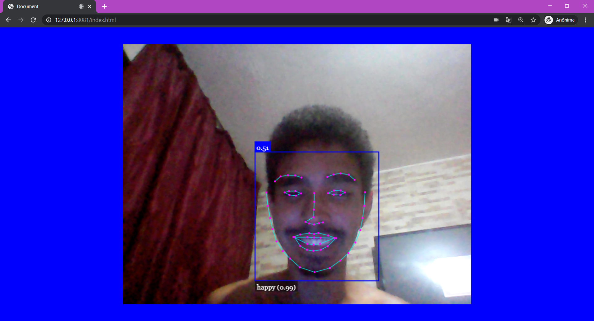
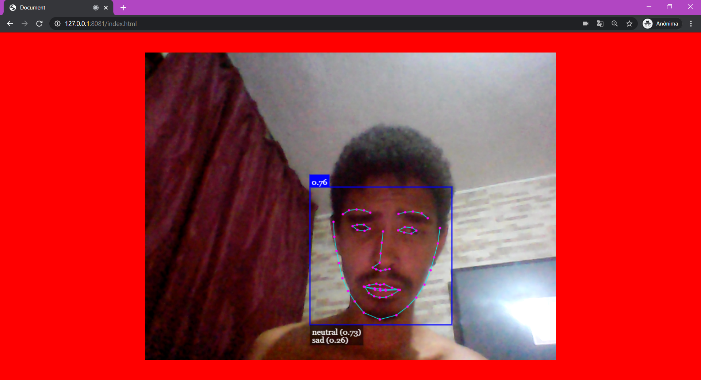

Opaa queridos, espero que estejam todos bem. Nessa publicação me dedico a apresentar alguns projetos pessoais e aplicações baseadas em inteligência artificial. Projetos de reconhecimento.

### 2018
Após um questionamento, fiquei motivado a iniciar uma pesquisa. "Será possível um computador reconhecer que alguem estava mentindo, analisando apenas os padrões faciais?".
Busquei achar o que me ajudaria. Primeiro reconhecer a face, depois a expressão facial. A ferramenta que atendeu foi [Face-api.js](https://github.com/justadudewhohacks/face-api.js).

Explorando a implementação, foi possível usar:
- Expressões faciais
- Estimativa de idade
- Sexo

Em seguida implementei uma forma de com tempo capturar e salvar a expressão do usuário (Felicidade, raiva, tristeza, neutro etc) para se ter uma média de qual expressão prevaleceu em um intervalo de tempo. A situação do projeto detector de mentiras tem sido uma implementação privada, sendo adicionado também um modo de reconhecer audios e variações na voz.

### 2019

O principal objetivo desta pesquisa foi o desenvolvimento de uma ferramenta para aplicações como websites ou aplicativos, que mude o estilo da tela através de reconhecimento facial e reconhecimento de expressões, para uma  interação nova do usuário.

As cores por exemplo na arte, tem um papel fundamental de expressar alguma informação. Na prática, esse uso é presente constantemente em fotografias, desenhos animados, em filmes, que utilizam por exemplo cores frias para transmitir sensação triste de solidão ou então cores quentes com intuito de passar sensação de felicidade e aconchego.

Esse foi o resultado do protótipo: 

)
### 2020 !!!

 Por fim, o projeto que tenho feito durante a quarentena e que mais me divertiu criar, esse que detecta OBJETOS!! Foi incrível os desafios. E encontra o código no git 👉 https://github.com/Icarobernard/Detector-de-objeto

### Video mais detalhado dos testes
<Embed
  src="https://www.youtube.com/embed/15BvvGsWdf0"
/>

> Muito obrigado por ter acompanhado projetos que tenho prazer em desenvolver e mostrar os resultados. Qualquer dúvida, entra em contato para mais esclarecimentos. tamo junto!

